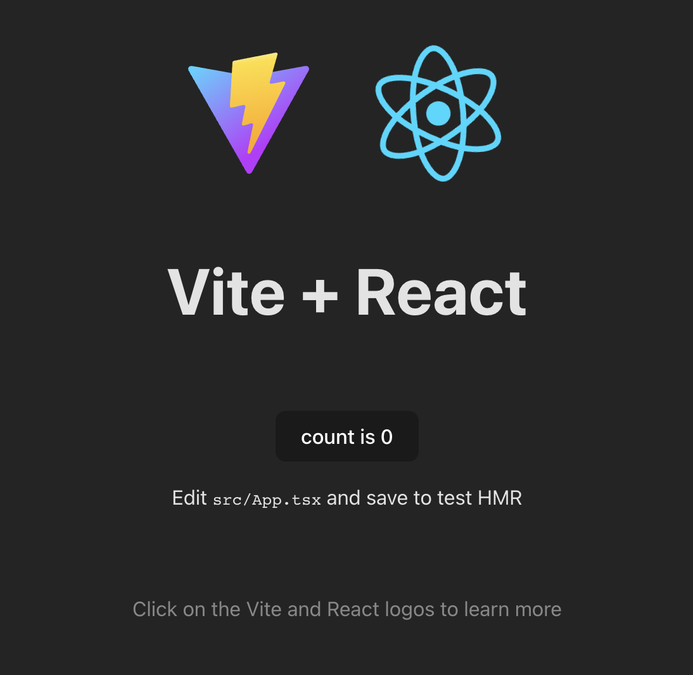

# 🌊 ViteWave

ViteWave is a **React project template** built with [Vite](https://vitejs.dev/), a next-generation frontend tooling that offers fast development and optimized build performance. This template provides a solid foundation for creating modern React applications with ease.

## 🚀 Getting Started

Follow these instructions to get your ViteWave project up and running on your local machine.

### 📋 Prerequisites

- [Node.js](https://nodejs.org/en/download/) (version 14.x or higher)
- [npm](https://www.npmjs.com/get-npm) (included with Node.js)

### ⚙️ Installing

- Clone the repository
- Run `npm install` to install all dependencies
- Run `npm run dev` to start the development server
- Run `npm run serve` to serve the project for production

## 🛠️ Built With

- [Vite](https://vitejs.dev/) - The build tool and development server
- [React](https://reactjs.org/) - The web library used for building the user interface

## 🙌 Acknowledgments

- The Vite team for creating a fast and efficient build tool
- The React community for their continuous support and resources
